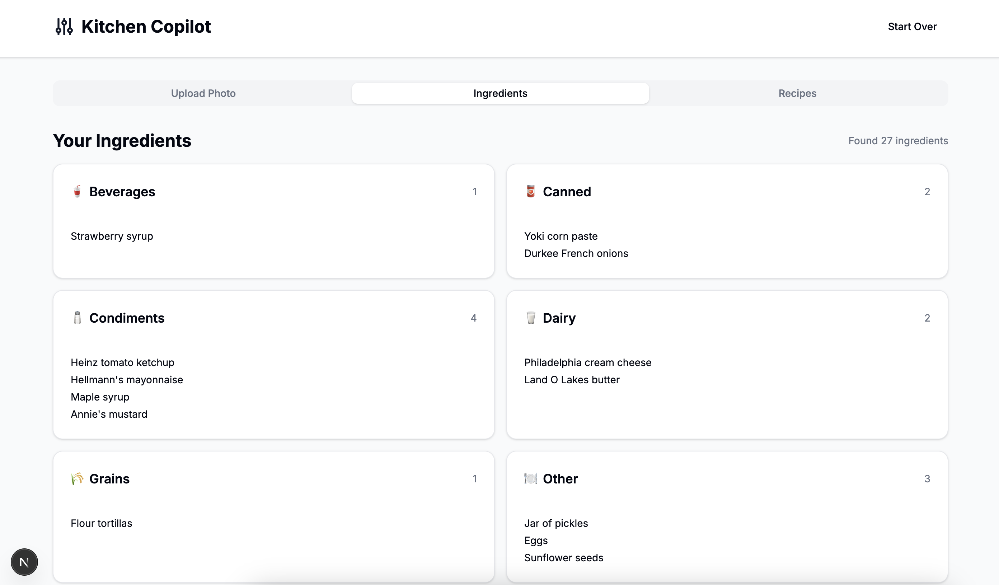

# Kitchen Copilot

An application that analyses your refrigerator contents through images and suggests recipes based on available ingredients.


## Features
- **Image Analysis**: Upload a photo of your fridge or food items to identify ingredients
- **Recipe Generation**: Get customized recipe suggestions based on identified ingredients
- **Dual Operation Modes**: Run as a CLI tool or as an API backend
- **Modern Frontend**: Interactive web interface for easy ingredient analysis and recipe browsing

## Requirements
- Python 3.8+
- Azure OpenAI API access with a deployed GPT-4 Vision model
- Node.js 18+ (for frontend)

## Setup

### Backend Setup
1. Clone the repository
2. Navigate to the project root
3. Install Python dependencies:
   ```bash
   pip install -r requirements.txt
   ```
4. Copy the `.env.example` file to `.env` and add your Azure OpenAI API keys and settings
5. Install CORS support for the API:
   ```bash
   pip install flask-cors
   ```

### Frontend Setup
1. Navigate to the frontend directory:
   ```bash
   cd kitchen-copilot-frontend
   ```
2. Install dependencies:
   ```bash
   npm install
   ```
3. Create a `.env.local` file with:
   ```
   NEXT_PUBLIC_API_URL=http://localhost:5000
   ```

## Usage

### Running the Full Application
1. Navigate to the backend directory:
   ```bash
   cd backend

2. Start the backend API server:
   ```bash
   python main.py --host 0.0.0.0 --port 5000
   ```

3. In a separate terminal, start the frontend development server:
   ```bash
   cd kitchen-copilot-frontend
   npm run dev
   ```

3. Open [http://localhost:3000](http://localhost:3000) in your browser to access the application

#### API Endpoints
- `POST /analyze-image`: Upload and analyze a fridge image
- `GET /ingredients`: Get ingredients from the most recent analysis
- `POST /generate-recipes`: Generate recipe suggestions based on available ingredients
- `GET /recipes`: Get previously generated recipes

## Demo Mode

For development and testing purposes, you can visit [http://localhost:3000/demo](http://localhost:3000/demo) to see the frontend with pre-filled sample data, without needing to connect to the backend API.

## Using Postman with the API

You can easily test the API endpoints using Postman. Here's how to make requests to each endpoint:

### 1. Analyze Image Endpoint (POST /analyze-image)

1. Open Postman and create a new POST request to `http://localhost:5000/analyze-image`
2. In the request builder, select the "Body" tab
3. Select "form-data"
4. Add a key named "file" and change the type from "Text" to "File"
5. Click "Select Files" and choose an image of your refrigerator
6. Click "Send" to submit the request

Example response:
```json
{
  "status": "complete",
  "result": {
    "ingredients": {
      "Dairy": ["milk", "cheddar cheese", "yogurt"],
      "Produce": ["carrots", "lettuce", "tomatoes", "onions"],
      "Proteins": ["chicken breast", "eggs"],
      "Condiments": ["ketchup", "mayonnaise", "mustard"]
    }
  },
  "summary": {
    "total_count": 10,
    "categories": 4,
    "by_category": {
      "Dairy": 3,
      "Produce": 4,
      "Proteins": 2,
      "Condiments": 3
    }
  },
  "image_filename": "image_1743074276_5115e30c.jpg",
  "request_id": "fridge_1743074276_5115e30c"
}
```

### 2. Get Ingredients Endpoint (GET /ingredients)

1. Create a new GET request to `http://localhost:5000/ingredients`
2. Optionally, you can add a query parameter named "request_id" if you want to get ingredients from a specific analysis
   - The request_id is returned in the analyze-image response (e.g., "fridge_630cee49")
3. Click "Send" to submit the request



Example response:
```json
{
  "ingredients": {
    "Dairy": ["milk", "cheddar cheese", "yogurt"],
    "Produce": ["carrots", "lettuce", "tomatoes", "onions"],
    "Proteins": ["chicken breast", "eggs"],
    "Condiments": ["ketchup", "mayonnaise", "mustard"]
  }
}
```

### 3. Get Recipes Endpoint (GET /recipes)

1. Create a new GET request to `http://localhost:5000/recipes`
2. Optionally, you can add a query parameter named "request_id" if you want to get recipes from a specific analysis
   - The request_id is returned in the analyze-image response (e.g., "fridge_630cee49")
3. Click "Send" to submit the request


Example response:
```json
{
  "items": [
    {
      "name": "Quick Chicken Salad",
      "total_ingredients": ["chicken breast", "lettuce", "tomatoes", "onions", "mayonnaise", "salt", "pepper"],
      "available_ingredients": ["chicken breast", "lettuce", "tomatoes", "onions", "mayonnaise"],
      "missing_ingredients": ["salt", "pepper"],
      "completeness_score": 71,
      "instructions": ["Step 1...", "Step 2..."],
      "cooking_time": "15 minutes",
      "difficulty": "Easy"
    }
  ],
  "analysis": [
    {
      "recipe_name": "Quick Chicken Salad",
      "completeness": 71,
      "available_count": 5,
      "missing_count": 2,
      "total_ingredients": 7,
      "cooking_time": "15 minutes",
      "difficulty": "Easy"
    }
  ],
  "ingredient_count": 10
}
```

### 4. Generate Recipes Endpoint (POST /generate-recipes)

1. Create a new POST request to `http://localhost:5000/generate-recipes`
2. In the request builder, select the "Body" tab
3. Select "raw" and choose "JSON" from the dropdown
4. Enter the request body:
   ```json
   {
     "num_recipes": 5,
     "request_id": "fridge_1743074276_5115e30c"
   }
   ```
   - Replace "fridge_1743074276_5115e30c" with the actual request_id from your analyze-image response
   - You can omit the request_id to use the most recent analysis
5. Click "Send" to submit the request

Example response:
```json
{
  "items": [
    {
      "name": "Quick Chicken Salad",
      "total_ingredients": ["chicken breast", "lettuce", "tomatoes", "onions", "mayonnaise", "salt", "pepper"],
      "available_ingredients": ["chicken breast", "lettuce", "tomatoes", "onions", "mayonnaise"],
      "missing_ingredients": ["salt", "pepper"],
      "completeness_score": 71,
      "instructions": ["Step 1...", "Step 2..."],
      "cooking_time": "15 minutes",
      "difficulty": "Easy"
    }
  ],
  "analysis": [
    {
      "recipe_name": "Quick Chicken Salad",
      "completeness": 71,
      "available_count": 5,
      "missing_count": 2,
      "total_ingredients": 7,
      "cooking_time": "15 minutes",
      "difficulty": "Easy"
    }
  ],
  "ingredient_count": 10
}
```

## Project Structure
```
kitchen-copilot/
├── .env                                                  # Environment variables
├── backend/                                              # Backend directory
│   ├── main.py                                           # Main entry point
│   ├── config.py                                         # Configuration and environment loading
│   ├── utils/                                            # Utility functions
│   ├── services/                                         # Core services
│   └── models/                                           # Data models
├── container/                                            # Container data
│   └── fridge/                                           # Fridge data
│       ├── fridge_1743074276_5115e30c/                   # Specific fridge instance
│           ├── image_1743074276_5115e30c.jpg
│           ├── ingredients_1743074276_5115e30c.json
│           └── recipes_1743074276_5115e30c.json
├── api/                                                  # API endpoints
└── kitchen-copilot-frontend/                             # Next.js frontend application
    ├── src/                                              # Frontend source code
    │   ├── app/                                          # Next.js app router pages
    │   ├── components/                                   # React components
    │   ├── lib/                                          # Utility functions and API client
    │   └── types/                                        # TypeScript type definitions
    ├── public/                                           # Static assets
    └── package.json                                      # Frontend dependencies
```

## Troubleshooting

### CORS Issues
If you encounter CORS errors when the frontend tries to communicate with the backend:

1. Make sure you've installed flask-cors:
   ```bash
   pip install flask-cors
   ```

2. Ensure your main.py includes:
   ```python
   from flask import Flask
   from flask_cors import CORS

   app = Flask(__name__)
   CORS(app)
   ```

### API Connection Issues
- Verify that the backend API is running on the correct host and port
- Check that `NEXT_PUBLIC_API_URL` in the frontend's `.env.local` matches the backend URL
- Try accessing the API directly in the browser (e.g., http://localhost:5000/ingredients)
