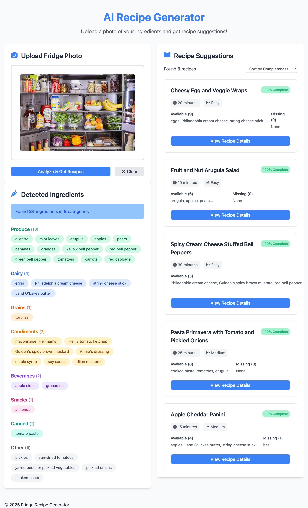

# AI Recipe Generator



An application that analyses your refrigerator contents through images and suggests recipes based on available ingredients.

## Features
- **Image Analysis**: Upload a photo of your fridge or food items to identify ingredients
- **Recipe Generation**: Get customized recipe suggestions based on identified ingredients
- **Dual Operation Modes**: Run as a CLI tool or as an API backend
- **Modern Frontend**: Interactive web interface for easy ingredient analysis and recipe browsing

## Requirements
- Python 3.8+
- Azure OpenAI API access with a deployed GPT-4 Vision model

## Setup

### Backend Setup
1. Clone the repository
2. Navigate to the project root
3. Install Python dependencies:
   ```bash
   pip install -r requirements.txt
   ```
4. Copy the `.env.example` file to `.env` and add your Azure OpenAI API keys and settings

## Usage

### CLI Mode
Analyze an image and generate recipes:
```bash
python main.py --mode cli --action both --image fridge.jpg --recipes 5
```

Just analyze an image:
```bash
python main.py --mode cli --action analyze --image fridge.jpg
```

Just generate recipes from previous analysis:
```bash
python main.py --mode cli --action recipes --recipes 7
```

### API Mode
Start the API server:
```bash
python main.py --mode api --host 0.0.0.0 --port 8000
```

#### API Endpoints
- `POST /analyze-image`: Upload and analyze a fridge image
- `GET /ingredients`: Get ingredients from the most recent analysis
- `POST /generate-recipes`: Generate recipe suggestions based on available ingredients

## Project Structure
```
fridge-recipes/
├── .env                     # Environment variables
├── main.py                  # Main entry point
├── config.py                # Configuration and environment loading
├── utils/                   # Utility functions
├── services/                # Core services
├── models/                  # Data models
├── data/                    # Data and prompts
│   ├── prompts/             # System prompts
│   └── results/             # Output directory
└── api/                     # API endpoints
```

## Example API Responses

### Image Analysis Endpoint (`/analyze-image`)
```json
{
  "status": "complete",
  "result": {
    "ingredients": {
      "Dairy": ["milk", "cheddar cheese", "yogurt"],
      "Produce": ["carrots", "lettuce", "tomatoes", "onions"],
      "Proteins": ["chicken breast", "eggs"],
      "Condiments": ["ketchup", "mayonnaise", "mustard"]
    }
  },
  "summary": {
    "total_ingredients": 10,
    "ingredient_categories": 4
  },
  "image_filename": "fridge_randomhex.jpg"
}
```

### Ingredients Endpoint (`/ingredients`)
```json
{
  "Dairy": ["milk", "cheddar cheese", "yogurt"],
  "Produce": ["carrots", "lettuce", "tomatoes", "onions"],
  "Proteins": ["chicken breast", "eggs"],
  "Condiments": ["ketchup", "mayonnaise", "mustard"]
}
```

### Recipes Generation Endpoint (`/generate-recipes`)
```json
{
  "recipes": [
    {
      "name": "Quick Chicken Salad",
      "total_ingredients": ["chicken breast", "lettuce", "tomatoes", "onions", "mayonnaise", "salt", "pepper"],
      "available_ingredients": ["chicken breast", "lettuce", "tomatoes", "onions", "mayonnaise"],
      "missing_ingredients": ["salt", "pepper"],
      "completeness_score": 71,
      "instructions": ["Step 1...", "Step 2..."],
      "cooking_time": "15 minutes",
      "difficulty": "Easy"
    }
  ],
  "analysis": [
    {
      "recipe_name": "Quick Chicken Salad",
      "ingredient_match_percentage": 71,
      "difficulty_rating": 2
    }
  ],
  "ingredient_count": 10
}
```
