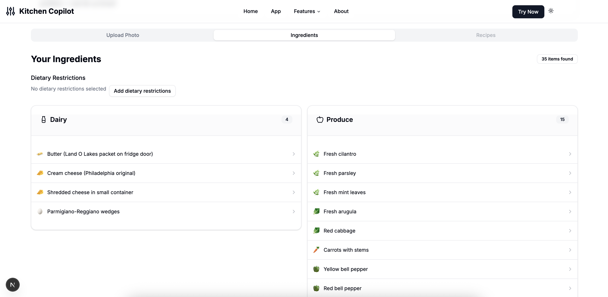

# Kitchen Copilot Frontend

A Next.js application that uses AI to analyze your refrigerator contents and suggest personalized recipes based on ingredients you already have.

## Features

- Upload photos of your refrigerator
- AI-powered ingredient detection
- Personalized recipe suggestions
- Dietary restriction filters
- Responsive design with dark/light mode

## Tech Stack

- Next.js 15
- React 19
- TypeScript
- Tailwind CSS
- shadcn/ui components
- Framer Motion animations

## Screenshots




## Getting Started

### Prerequisites

- Node.js 18.0 or later
- npm or yarn

### Installation

1. Clone the repository:

```bash
git clone https://github.com/yourusername/kitchen-copilot-frontend.git
cd kitchen-copilot-frontend
```

2. Install dependencies:

```bash
npm install
# or
yarn install
```

3. Create a `.env.local` file in the root directory with the following variables:

```
NEXT_PUBLIC_API_URL=your_api_url_here
NEXT_PUBLIC_FUNCTION_KEY=your_function_key_here
```

4. Start the development server:

```bash
npm run dev
# or
yarn dev
```

5. Open [http://localhost:3000](http://localhost:3000) in your browser to see the application.

## Project Structure

- `/src/app` - Next.js app router pages
- `/src/components` - React components
  - `/src/components/ui` - shadcn/ui components
  - `/src/components/kitchen` - Custom components for the application
- `/src/lib` - Utility functions and API client
- `/src/types` - TypeScript type definitions

## Available Scripts

- `npm run dev` - Start the development server
- `npm run build` - Build the application for production
- `npm start` - Start the production server
- `npm run lint` - Run ESLint

## License

This project is licensed under the MIT License.
